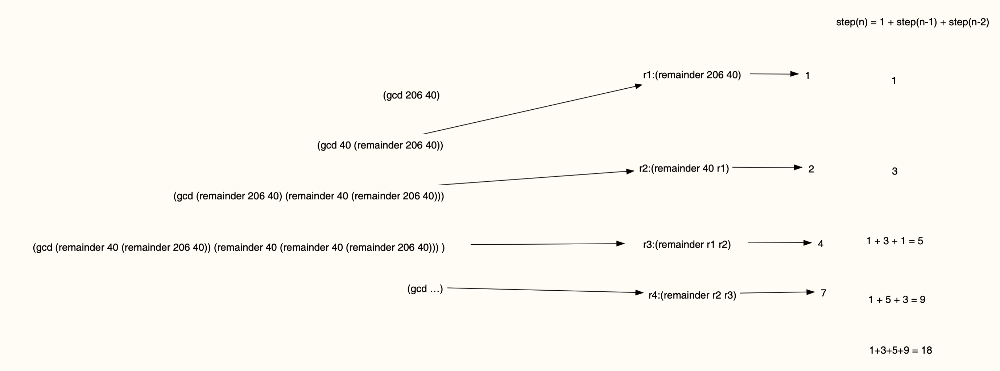

Expand the calculating process in normal-order.

How many times that the function remainder are excuted?



The `remainder` are excuted 6 times.

If the calculating process is in applicative order,
the `remainder` will be excuted 4 times.

```lisp
(gcd 206 40)
(gcd 40 6)      ; (gcd 40 (remainder 206 40)
(gcd 6 4)       ; (gcd 6 (remainder 40 6))
(gcd 4 2)       ; (gcd 4 (remainder 6 4))
(gcd 2 0)       ; (gcd 2 (remainder 2 2))
2
```

